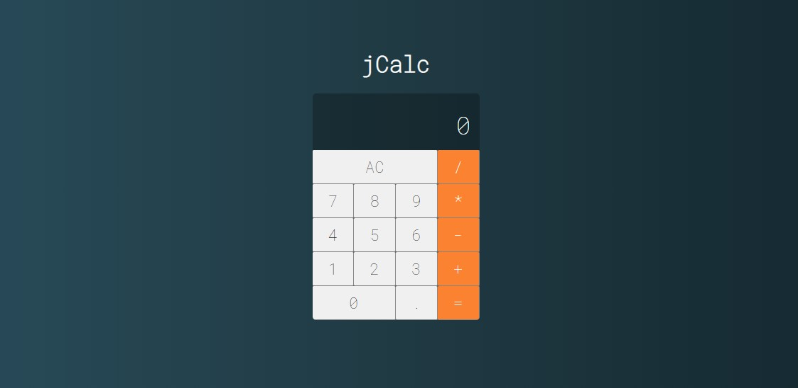

<h1 align="center">
  :1234: jCalc 2 - My Second Calculator
</h1>

- **Project proposed by:** [Cod3r](https://www.cod3r.com.br/)
- **Project developed by:** [Julio L. Muller](https://github.com/juliolmuller)
- **Released on:** Apr 23, 2020
- **Updated on:** Oct 23, 2020
- **Latest version:** 2.0.2
- **License:** MIT



Application developed during [Cod3r's official Vue.js course](https://www.udemy.com/course/vue-js-completo/), on Udemy, in order to create a clone of MacOS calculator with Vue.js and the amazing CSS Grid to make development way smoother for elements positioning.

[Check out the application running!](https://juliolmuller.github.io/jcalc-2/)

## :trophy: Lessons Learned

- Vue.js 2 components communication;
- CSS Grid;

## :hammer: Technologies & Resources

**Frontend:**
- Vue.js 2

**Development:**
- Visual Studio Code
- Vue CLI & Node.js routines

## :bell: Setting up the Environment

Make sure to have **Node.js 10+** installed in your machine and its **npm** available in the command line, then use the following routines:

```bash
$ npm install   # Download dependencies
$ npm start     # Run development server
$ npm run build # Build files for production
```

# :zap: Features Implementations

:black_square_button: Upgrade to Vue 3 and use Composition API;
:ballot_box_with_check: Overall layout and design;
:ballot_box_with_check: Traditional calculator operations (`+`, `-`, `*`, `/` and *CLEAR*);
:ballot_box_with_check: Continuous calculations by pressing `=` repeatedly;
:black_square_button: Continuous calculations by chaining other operations (without pressing `=`);
:black_square_button: Support to keyboard input;
:black_square_button: Support to copy & paste by pressing `Ctrl + C` & `Ctrl + V`;
:black_square_button: Sounds on typing (with icon to enable/disable);
:black_square_button: Add automated testing (unit and E2E);
